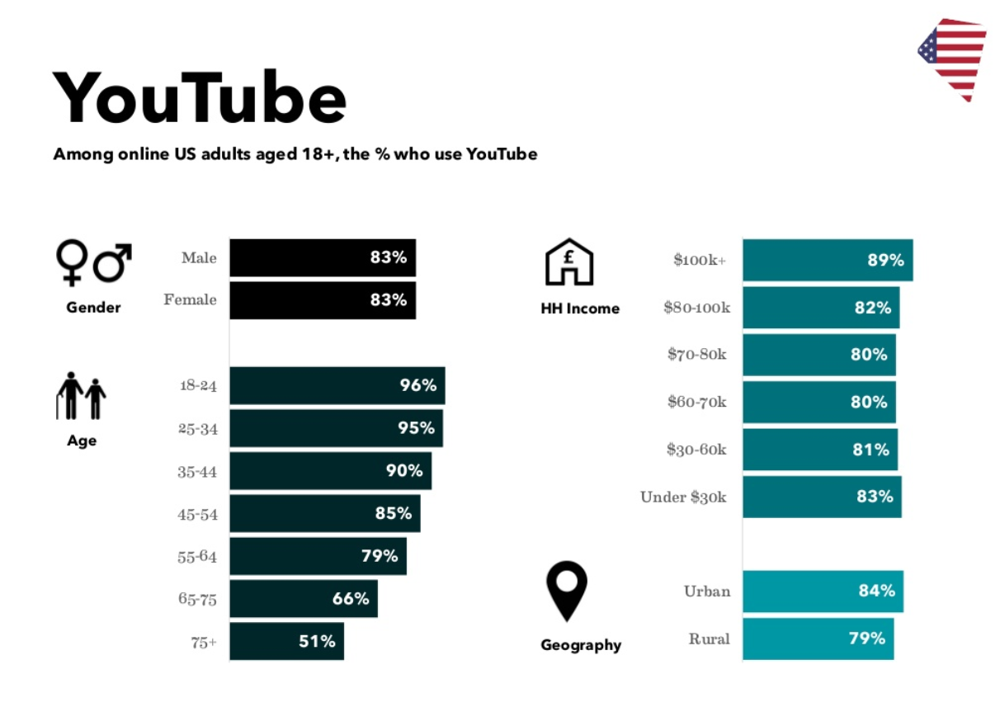
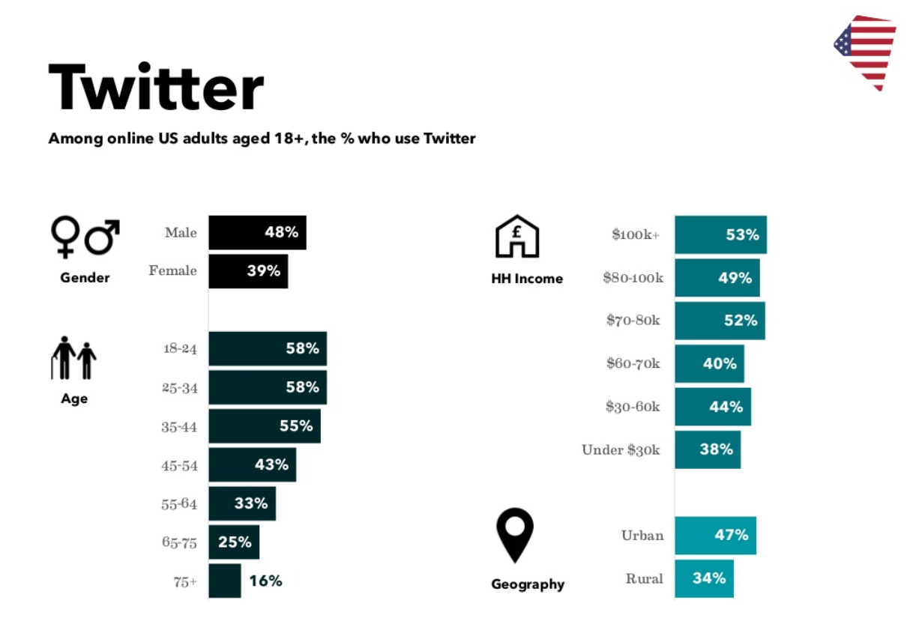
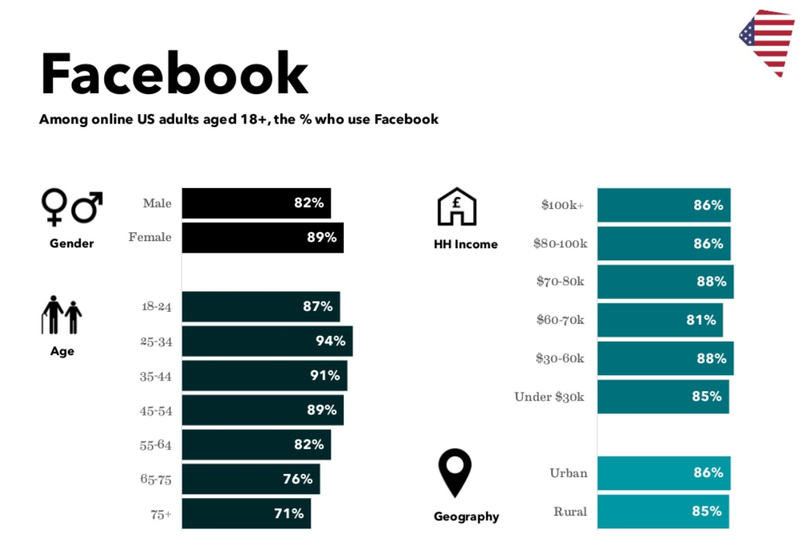

# Results

## Youtube

### Initial Investigation

Here is the result for total views per candiate online:
```{r, warning=FALSE, echo=FALSE}
library(tidyverse)
library(dplyr)
library(choroplethr)
library(ggplot2)
library(plotly)

# load social meida data - Youtube, from 11/15/2019:
df <- read.csv("data/2019-11-15.csv")

df <- filter(df, candidate != "Donald Trump") 

temp <- 
  df %>%
  group_by(candidate) %>%
  summarise(view=sum(as.numeric(view)))


ggplot(temp, aes(x = reorder(candidate, view), y=view)) +
  geom_bar(stat="identity") +
  xlab("Candidate Name") +
  ylab("Views") +
  ggtitle("Total Youtube Views") +
  coord_flip()

```


Here is the result for views density per candidate per state:
```{r, warning=FALSE, echo=FALSE}
# load social meida data - Youtube, from 12/12/2019:
df2 <- read.csv("data/2019-12-12.csv")

df2 <- filter(df2, candidate != "Donald Trump")

df2 <- filter(df2, title!="2020 Democratic Debate - SNL")  # remove irrelated videos

df2 <- filter(df2, title!="DNC Town Hall - SNL")  # remove irrelated videos

df2 <- filter(df2, title!="2020 November Democratic Debate in Atlanta | The Daily Show")  # remove irrelated videos

df2 <- filter(df2, title!="2020 October Democratic Debate in Ohio | The Daily Show")  # remove irrelated videos

df2 <- filter(df2, title!="Stephen Colbert Breaks Down The 5th Democratic Presidential Debate")  # remove irrelated videos

df2 <- filter(df2, title!="Democratic candidates debate: Opening statements l ABC News")  # remove irrelated videos

df2 <- filter(df2, title!="I'm Gay - Eugene Lee Yang")  # remove irrelated videos

df2 <- filter(df2, title!="Mark Morrison - Return Of The Mack [OFFICIAL MUSIC VIDEO]")  # remove irrelated videos

df2 <- filter(df2, title!="Kavanaugh Hearing Cold Open - SNL")  # remove irrelated videos

df2 <- filter(df2, title!="THE CONJURING - The Real Lorraine Warren Featurette")  # remove irrelated videos


# We also would like to visualize these 2 questions in one series of plots using choropleth maps:

## a) In each state, which candidate has more popularity online, in terms of views, likes, retweets...etc ?
## b) For each candidate, in which state he/she has more popularity online, in terms of views, likes, retweets...etc ?


candidates <- c('Amy Klobuchar','Andrew Yang','Bernie Sanders','Cory Booker','Elizabeth Warren','Joe Biden','Kamala Harris','Pete Buttigieg','Tom Steyer','Tulsi Gabbard')

for(i in candidates) {
  # i-th name of candiates
  # ------------------------------------------------------
  temp <- filter(df2, candidate == i) 
  
  temp <- temp %>% 
    as.data.frame() %>% 
    transmute(region = tolower(`state`), value = as.numeric(temp$view))
  
  # unique(df$region)  45 states
  
  temp <- temp %>%
    group_by(region) %>%
    summarise(value = sum(value))
  
  temp <- na.omit(temp)

  p <- state_choropleth(temp,
                   title = paste(i," - State Youtube Views"),
                   legend = "View Count")
  
  print(p)
  # ------------------------------------------------------
}
```

From the series of plots using choropleth maps, we can compare:
a) In each state, which candidate has more popularity online, in terms of views.
b) For each candidate, in which state he/she has more popularity online, in terms of views.


### Topic Analysis

Here are word cloud plots for top topics in 2020 presidential election on Youtube: 
```{r, warning=FALSE, echo=FALSE}
library(tm)
library(SnowballC)
library(RColorBrewer)
library(wordcloud)

# Note: Here are a couple of important definitions.
# 
# scale: Indicates the range of sizes of the words.
# max.words: Plots the specified number of words and discard least frequent terms.
# min.freq: Discards all terms whose frequency is below the specified value.
# random.order: By setting this to false, we make it so that the words with the highest frequency are plotted first. If we don’t set this, it will plot the words in a random order and the highest frequency words may not necessarily appear in the center.
# rot.per: Determines the fraction of words that are plotted vertically.
# colors: The default value is black. If you want to use different colors based on frequency, you can specify a vector of colors or use one of the pre-defined color palettes.

  
  # Calculate Corpus
  videoDS.Corpus<-Corpus(VectorSource(df2$description))
  
  
  # Data Cleaning and Wrangling
  videoDS.Clean<-tm_map(videoDS.Corpus, PlainTextDocument)
  videoDS.Clean<-tm_map(videoDS.Corpus,tolower)
  videoDS.Clean<-tm_map(videoDS.Clean,removeNumbers)
  videoDS.Clean<-tm_map(videoDS.Clean,removeWords,stopwords("english"))
  videoDS.Clean<-tm_map(videoDS.Clean,removeWords,stopwords("spanish"))
  videoDS.Clean<-tm_map(videoDS.Clean,removePunctuation)
  videoDS.Clean<-tm_map(videoDS.Clean,stripWhitespace)
  videoDS.Clean<-tm_map(videoDS.Clean,stemDocument)

  
  # wordcloud(videoDS.Clean,max.words = 1000,random.color = TRUE,random.order=FALSE)
  layout(matrix(c(1, 2), nrow=2), heights=c(1, 4))
  par(mar=rep(0, 4))
  plot.new()
  text(x=0.5, y=0.5, cex= 1.5, "Topics from Candidate - All", font = 2, col="darkgray")
  wordcloud(words = videoDS.Clean, min.freq = 10,
            max.words=1000, random.order=FALSE, rot.per=0.25, 
            colors=brewer.pal(10, "Dark2"))


  candidates <- c('Amy Klobuchar','Andrew Yang','Bernie Sanders','Cory Booker','Elizabeth Warren','Joe Biden','Kamala Harris','Pete Buttigieg','Tom Steyer','Tulsi Gabbard')
  
  for(i in candidates) {
    # i-th name of candiates
    # ------------------------------------------------------
    temp <- filter(df2, candidate == i) 
    
    # Calculate Corpus
    videoDS.Corpus<-Corpus(VectorSource(temp$description))
    
    
    # Data Cleaning and Wrangling
    videoDS.Clean<-tm_map(videoDS.Corpus, PlainTextDocument)
    videoDS.Clean<-tm_map(videoDS.Corpus,tolower)
    videoDS.Clean<-tm_map(videoDS.Clean,removeNumbers)
    videoDS.Clean<-tm_map(videoDS.Clean,removeWords,stopwords("english"))
    videoDS.Clean<-tm_map(videoDS.Clean,removeWords,stopwords("spanish"))
    videoDS.Clean<-tm_map(videoDS.Clean,removePunctuation)
    videoDS.Clean<-tm_map(videoDS.Clean,stripWhitespace)
    videoDS.Clean<-tm_map(videoDS.Clean,stemDocument)
    
    
    # wordcloud(videoDS.Clean,max.words = 1000,random.color = TRUE,random.order=FALSE)
    layout(matrix(c(1, 2), nrow=2), heights=c(1, 4))
    par(mar=rep(0, 4))
    plot.new()
    text(x=0.5, y=0.5, cex= 1.5, paste("Topics from Candidate - ", i, sep=""), font = 2, col="darkgray")
    wordcloud(words = videoDS.Clean, min.freq = 100,
              max.words=1000, random.order=FALSE, rot.per=0.35, 
              colors=brewer.pal(8, "Dark2"))
    # ------------------------------------------------------
  }
```


### Popularity Analysis

* Here are the core plots for our study to show which candidate are actually more popular online, based on video viewers' likes and dislikes aggragation:
```{r, warning=FALSE, echo=FALSE}
library(HH)

temp <- 
  df2 %>%
  group_by(candidate) %>%
  summarise(dilike=sum(as.numeric(dislike)), like=sum(as.numeric(like)))


HH::likert(candidate ~ ., temp, xlab = 'Percent',
           main = list('Youtube Diverage Candidate\'s Popularity - Absolute Value', cex = 0.7), positive.order = T, col=c('#6f8df7','#f582ae'))


temp2 <- 
  df2 %>%
  group_by(candidate) %>%
  summarise(dilike=sum(as.numeric(dislike))/(sum(as.numeric(dislike))+sum(as.numeric(like))), like=sum(as.numeric(like))/(sum(as.numeric(dislike))+sum(as.numeric(like))))


HH::likert(candidate ~ ., temp2, xlab = 'Percent',
           main = list('Youtube Diverage Candidate\'s Popularity - Percentage', cex = 0.7), positive.order = T, col=c('#6f8df7','#f582ae'))

```


* Here are core plots for our study to show which candidate in which state are actually more popular online, based on video viewers' likes and dislikes aggragation:
```{r, warning=FALSE, echo=FALSE}

candidates <- c('Amy Klobuchar','Andrew Yang','Bernie Sanders','Cory Booker','Elizabeth Warren','Joe Biden','Kamala Harris','Pete Buttigieg','Tom Steyer','Tulsi Gabbard') 

for(i in candidates) {
  # i-th name of candiates
  # ------------------------------------------------------
  temp <- filter(df2, candidate == i) 
  
  temp <- temp %>% 
    as.data.frame() %>% 
    transmute(region = tolower(`state`), value = (as.numeric(temp$like)-as.numeric(temp$dislike)))
  # unique(df$region)  45 states
  
  temp <- temp %>%
    group_by(region) %>%
    summarise(value = sum(value))
  
  temp <- na.omit(temp)
  
  p <- state_choropleth(temp,
                   title = paste(i," - State Youtube Likes"),
                   legend = "Like Count")
  

  print(p)
  # ------------------------------------------------------
}


```


### Comment Analysis


Here are word cloud for comments per candidate on Youtube:
```{r, warning=FALSE, echo=FALSE}
library(tm)
library(SnowballC)
library(RColorBrewer)
library(wordcloud)

library(HH)

# load social meida data - Youtube, from 12/12/2019:
df3 <- read.csv("data/2019-12-12_comment.csv")
# summary(df3$candidate)

candidates <- c('Amy Klobuchar','Andrew Yang','Bernie Sanders','Cory Booker','Elizabeth Warren','Joe Biden','Kamala Harris','Pete Buttigieg','Tom Steyer','Tulsi Gabbard')

for(i in candidates) {
  # i-th name of candiates
  # ------------------------------------------------------
  temp <- filter(df3, candidate == i) 
  
  # Calculate Corpus
  videoDS.Corpus<-Corpus(VectorSource(temp$comment))
  
  
  # Data Cleaning and Wrangling
  videoDS.Clean<-tm_map(videoDS.Corpus, PlainTextDocument)
  videoDS.Clean<-tm_map(videoDS.Corpus,tolower)
  videoDS.Clean<-tm_map(videoDS.Clean,removeNumbers)
  videoDS.Clean<-tm_map(videoDS.Clean,removeWords,stopwords("english"))
  videoDS.Clean<-tm_map(videoDS.Clean,removeWords,stopwords("spanish"))
  videoDS.Clean<-tm_map(videoDS.Clean,removePunctuation)
  videoDS.Clean<-tm_map(videoDS.Clean,stripWhitespace)
  videoDS.Clean<-tm_map(videoDS.Clean,stemDocument)
  
  
  # wordcloud(videoDS.Clean,max.words = 1000,random.color = TRUE,random.order=FALSE)
  layout(matrix(c(1, 2), nrow=2), heights=c(1, 4))
  par(mar=rep(0, 4))
  plot.new()
  text(x=0.5, y=0.5, cex= 1.5, paste("Comments for Candidate - ", i, sep=""), font = 2, col="darkgray")
  wordcloud(words = videoDS.Clean, min.freq = 200,
            max.words=500, random.order=FALSE, rot.per=0.35, 
            colors=brewer.pal(8, "Dark2"))
  
  # ------------------------------------------------------
}
```


* Here is one of the core plots for our study to show the total diverging sentiment score per candidate on Youtube:
```{r, warning=FALSE, echo=FALSE}
## Sentiment Score 

word.pos = readLines('data/positive-words.txt');
word.neg = readLines('data/negative-words.txt');

score.sentiment = function(sentences, candidate, pos.words, neg.words, .progress='none')
  {
    require(plyr);
    require(stringr);
    scores = laply(sentences, function(sentence, pos.words, neg.words) {
      sentence = gsub('[^A-z ]','', sentence)
      sentence = tolower(sentence);
      word.list = str_split(sentence, '\\s+');
      words = unlist(word.list);
      pos.matches = match(words, pos.words);
      neg.matches = match(words, neg.words);
      pos.matches = !is.na(pos.matches);
      neg.matches = !is.na(neg.matches);
      score = sum(pos.matches) - sum(neg.matches);
      return(score);
    }, pos.words, neg.words, .progress=.progress );
    scores.df = data.frame(score=scores, text=sentences, candidate=candidate);
    return(scores.df);
}

#Test
# sample=c("You're awesome and I love you","I hate and hate and hate. So angry. Die!","Impressed and amazed: you are peerless in your achievement of unparalleled mediocrity.")
# result=score.sentiment(sample, 'TEST', word.pos,word.neg)
# 

candidates <- c('Amy Klobuchar','Andrew Yang','Bernie Sanders','Cory Booker','Elizabeth Warren','Joe Biden','Kamala Harris','Pete Buttigieg','Tom Steyer','Tulsi Gabbard')

df_merge <- data.frame()


for(i in candidates) {
  # i-th name of candiates
  # ------------------------------------------------------
  temp <- filter(df3, candidate == i) 
  
  # Calculate Corpus
  result=score.sentiment(temp$comment, i, word.pos,word.neg)
  
  result <- result %>%
    group_by(candidate) %>%
    summarise(sentiment=sum(as.numeric(score)))
  
  df_merge <- rbind(df_merge, result)
  # ------------------------------------------------------
}

# ?
# temp <- 
#   df_merge %>%
#   group_by(candidate) %>%
#   summarise(sentiment=s(as.numeric(score)))

ggplot(df_merge, aes(x = reorder(candidates, sentiment), y=sentiment)) +
  geom_bar(stat="identity", fill=c('#f582ae','#f582ae','#f582ae','#f582ae','#f582ae','#f582ae','#6f8df7','#f582ae','#f582ae','#f582ae')) +
  xlab("Candidate Name") +
  ylab("Sentiment Score") +
  ggtitle("Youtube Total Sentiment Score (Positive: Red, Negative: Blue)") +
  coord_flip()

```
 
### Demographics




## Twitter

### Tweet Analysis

Here are word cloud plots for top topics in 2020 presidential election on Twitter: (Bonus viz on "twitter president")

```{r, warning=FALSE, echo=FALSE}
# load social meida data - Twitter, from 12/12/2019:
df4 <- read.csv("data/twitter_tweet.csv")

candidates <- c('Donald Trump','Amy Klobuchar','Andrew Yang','Bernie Sanders','Cory Booker','Elizabeth Warren','Joe Biden','Kamala Harris','Pete Buttigieg','Tom Steyer','Tulsi Gabbard')

for(i in candidates) {
  # i-th name of candiates
  # ------------------------------------------------------
  temp <- filter(df4, candidate == i) 
  
  # Calculate Corpus
  tweetDS.Corpus<-Corpus(VectorSource(temp$tweet))
  
  # Data Cleaning and Wrangling
  tweetDS.Clean<-tm_map(tweetDS.Corpus, PlainTextDocument)
  tweetDS.Clean<-tm_map(tweetDS.Corpus,tolower)
  tweetDS.Clean<-tm_map(tweetDS.Clean,removeNumbers)
  tweetDS.Clean<-tm_map(tweetDS.Clean,removeWords,stopwords("english"))
  tweetDS.Clean<-tm_map(tweetDS.Clean,removeWords,stopwords("spanish"))
  tweetDS.Clean<-tm_map(tweetDS.Clean,removePunctuation)
  tweetDS.Clean<-tm_map(tweetDS.Clean,stripWhitespace)
  tweetDS.Clean<-tm_map(tweetDS.Clean,stemDocument)
  
  
  # wordcloud(tweetDS.Clean,max.words = 1000,random.color = TRUE,random.order=FALSE)
  layout(matrix(c(1, 2), nrow=2), heights=c(1, 4))
  par(mar=rep(0, 4))
  plot.new()
  text(x=0.5, y=0.5, cex=1.5, paste("Tweets for Candidate - ", i, sep=""), font = 2, col="darkgray")
  wordcloud(words = tweetDS.Clean, min.freq = 1,
            max.words=1000, random.order=FALSE, rot.per=0.35, 
            colors=brewer.pal(8, "Dark2"))
  
  # ------------------------------------------------------
}
```

* Here is one of the core plots for our study to show the total diverging sentiment score per candidate on Twitter:
```{r, warning=FALSE, echo=FALSE}
candidates <- c('Donald Trump','Amy Klobuchar','Andrew Yang','Bernie Sanders','Cory Booker','Elizabeth Warren','Joe Biden','Kamala Harris','Pete Buttigieg','Tom Steyer','Tulsi Gabbard')

df_merge <- data.frame()


for(i in candidates) {
  # i-th name of candiates
  # ------------------------------------------------------
  temp <- filter(df4, candidate == i) 
  
  # Calculate Corpus
  result=score.sentiment(temp$tweet, i, word.pos,word.neg)
  
  result <- result %>%
    group_by(candidate) %>%
    summarise(sentiment=sum(as.numeric(score)))
  
  df_merge <- rbind(df_merge, result)
  # ------------------------------------------------------
}


ggplot(df_merge, aes(x = reorder(candidates, sentiment), y=sentiment)) +
  geom_bar(stat="identity", fill=c('#6f8df7','#f582ae','#f582ae','#f582ae','#f582ae','#f582ae','#f582ae','#6f8df7','#f582ae','#6f8df7','#f582ae')) +
  xlab("Candidate Name") +
  ylab("Sentiment Score") +
  ggtitle("Twitter Total Sentiment Score (Positive: Red, Negative: Blue)") +
  coord_flip()

```

### Demographics




## Facebook

### Post Analysis

Here are word cloud for posts per candidate on Facebook:
```{r, warning=FALSE, echo=FALSE}

# load social meida data - Youtube, from 12/12/2019:
df5 <- read.csv("data/facebook_post.csv")
# summary(df3$candidate)

candidates <- c('Donald Trump','Amy Klobuchar','Andrew Yang','Bernie Sanders','Cory Booker','Elizabeth Warren','Joe Biden','Kamala Harris','Pete Buttigieg','Tom Steyer','Tulsi Gabbard')

for(i in candidates) {
  # i-th name of candiates
  # ------------------------------------------------------
  temp <- filter(df5, candidate == i) 
  
  # Calculate Corpus
  postDS.Corpus<-Corpus(VectorSource(temp$post))
  
  
  # Data Cleaning and Wrangling
  postDS.Clean<-tm_map(postDS.Corpus, PlainTextDocument)
  postDS.Clean<-tm_map(postDS.Corpus,tolower)
  postDS.Clean<-tm_map(postDS.Clean,removeNumbers)
  postDS.Clean<-tm_map(postDS.Clean,removeWords,stopwords("english"))
  postDS.Clean<-tm_map(postDS.Clean,removeWords,stopwords("spanish"))
  postDS.Clean<-tm_map(postDS.Clean,removePunctuation)
  postDS.Clean<-tm_map(postDS.Clean,stripWhitespace)
  postDS.Clean<-tm_map(postDS.Clean,stemDocument)
  
  
  # wordcloud(videoDS.Clean,max.words = 1000,random.color = TRUE,random.order=FALSE)
  layout(matrix(c(1, 2), nrow=2), heights=c(1, 4))
  par(mar=rep(0, 4))
  plot.new()
  text(x=0.5, y=0.5, cex= 1, paste("Comments for Candidate - ", i, sep=""), font = 2, col="darkgray")
  wordcloud(words = postDS.Clean, min.freq = 1,
            max.words=1000, random.order=FALSE, rot.per=0.35, 
            colors=brewer.pal(8, "Dark2"))
  
  # ------------------------------------------------------
}
```

* Here is one of the core plots for our study to show the total sentiment score per candidate on Facebook:
```{r, warning=FALSE, echo=FALSE}
candidates <- c('Donald Trump','Amy Klobuchar','Andrew Yang','Bernie Sanders','Cory Booker','Elizabeth Warren','Joe Biden','Kamala Harris','Pete Buttigieg','Tom Steyer','Tulsi Gabbard')

df_merge <- data.frame()


for(i in candidates) {
  # i-th name of candiates
  # ------------------------------------------------------
  temp <- filter(df5, candidate == i) 
  
  # Calculate Corpus
  result=score.sentiment(temp$post, i, word.pos,word.neg)
  
  result <- result %>%
    group_by(candidate) %>%
    summarise(sentiment=sum(as.numeric(score)))
  
  df_merge <- rbind(df_merge, result)
  # ------------------------------------------------------
}

# ?
# temp <- 
#   df_merge %>%
#   group_by(candidate) %>%
#   summarise(sentiment=s(as.numeric(score)))

ggplot(df_merge, aes(x = reorder(candidates, sentiment), y=sentiment)) +
  geom_bar(stat="identity", fill=c('#f582ae','#f582ae','#f582ae','#f582ae','#f582ae','#f582ae','#f582ae','#f582ae','#f582ae','#f582ae','#f582ae')) +
  xlab("Candidate Name") +
  ylab("Sentiment Score") +
  ggtitle("Facebook Total Sentiment Score") +
  coord_flip()


```

### Demographics



(Please note: We have more demographics analysis in Chapter-6, as interactive components.)


<center>
[](https://github.com/columbia-dsi/SocialMediaElection2020)
</center>