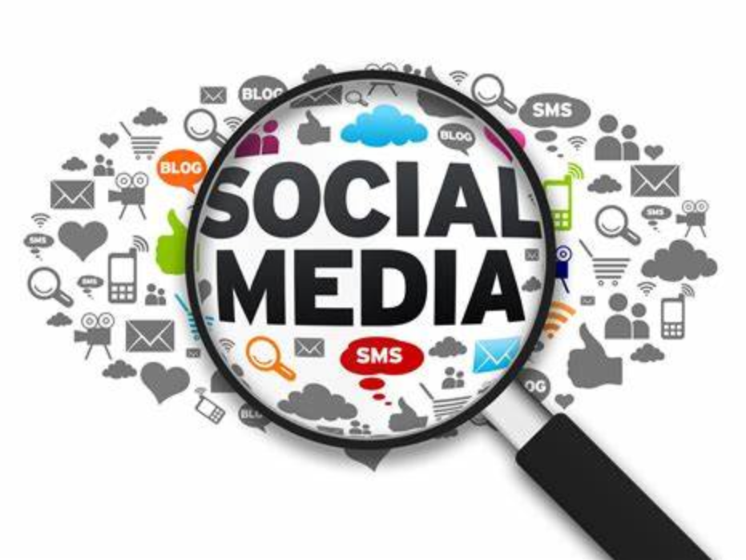
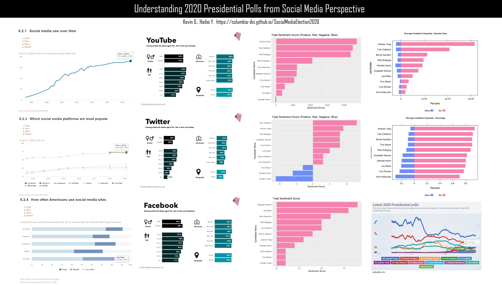
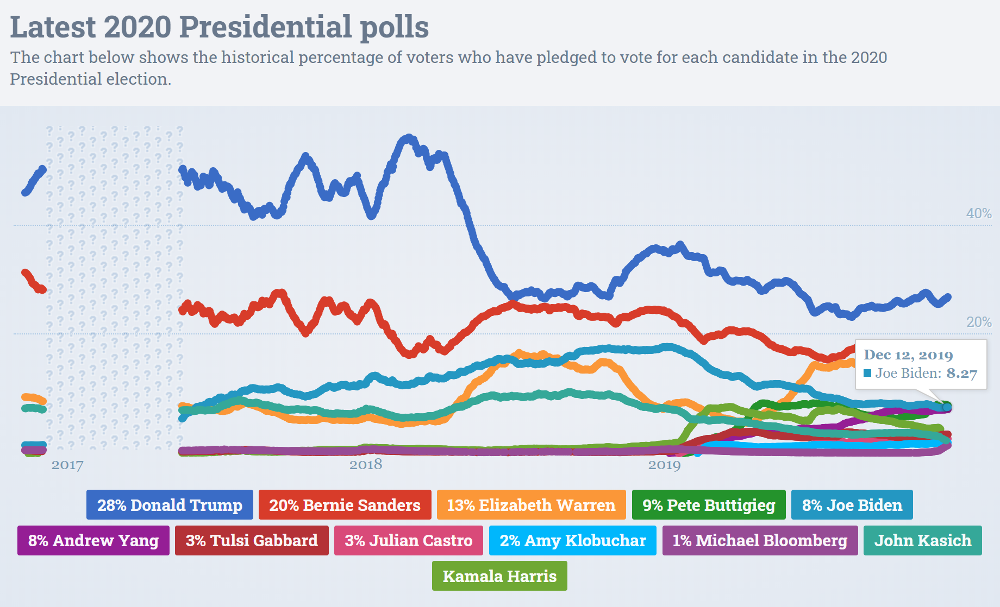

# Conclusion

The use of social media in politics including Twitter, Facebook, and YouTube has dramatically changed the way campaigns are run and how Americans interact with their elected officials. The prevalence of social media in politics has made elected officials and candidates more accountable and accessible to voters.

From our close look at social media data and analyze with demographics data collected online, and the study on U.S. social media usage, we focus on Youtube as it's a main streaming channel for general public, and we feel pretty confident that the data represents general public behavrios onilne and coverages to some solid results, now we would like to share those insights from our study towards 2020 presidential election:

1. In general, we can see the current candidates' popularity ranking on Youtube is:Andrew Yang > Tulsi Gabbard  > Bernie Sanders > Tom Steyer > Pete Buttigieg > Elizabeth Warren > Kamala Harris > Joe Biden > Cory Booker > Amy Kilobuchar (From this [result](results.html#popularity-analysis)) Which is not exactly aligned with the national polls, results definitely show weak correlation between Youtube likes and poll results. To help understand this, according the demographics study on Youtube, most active viewers are uban young people, who may or may not have right to vote yet, some of those are not U.S. citizen, so this result shouldn't surprise us too much. 

   

2. From the Youtube state series choropleth maps, both static and interactive ones, we can see the top candidates like Bernie Sanders, Joe Biden and Elizabeth Warren has more views data across states, this could depend on different amount they have spent on advertising, however, on the other hand, videos with more views don't always have more likes, so the likes data indicates there is weak correlation between Youtbue likes and candidates budget.

3. In general, from Youtube views by state chart, most views across all candiate appear both east and west coast, major urban cities, which indicates that peopel from the 11 swing states watch less youtube videos of these democrat candidates.

4. In general, from Youtube likes by state chart, there is no likes pattern cross candidates, each candidate's popular states are different, and the difference between the states are often huge. This could be related to their residential location and policy coverage.

5. From the Youtube title and description data, we can see different candidate is focusing on different topics. (From this [result](results.html#topic-analysis))

6. From the Youtube comments data, we can rank the sentiment score of comments in each candidate's videos: (From this [result](results.html#comment-analysis)) Andrew Yang > Tulsi Gabbard  > Pete Buttigieg > Bernie Sanders > Amy Kilobuchar > Tom Steyer > Elizabeth Warren > Cory Booker >  Joe Biden > Kamala Harris. Which is not exactly aligned with the national polls, results definitely show weak correlation between Youtube likes and poll results.

7. From Twitter tweets data, we can see different candidate talks different topics and their sentiment score are very diverging. (From this [result](results.html#tweet-analysis))

8. From Facebook posts data, we can see different candidate talks different topics and their sentiment score are not very diverging, mostly positive. (From this [result](results.html#postfacebook-analysis))

Finally, our latest study unveils how social media diverges from presidential election polls.

Now compare our core plots to the latest 2020 Presidential polls, in a modern society: social media vs. the real world, do you have a better understanding of it? Or do you have another angle to review the biased media results? 

Hope these social media data analysis can help you understand better about 2020 Presidential Polls, feel free to send feedbacks, and don't forget to vote! 

Future thoughts

If we have the voting power data for social media users (i.e. Youtube viewers who can actually vote), we could possible dig into further study about how much the social media results and polls are biased in their disagreement. And is there statistically significant different enough to reject the null hypothesis of media bias.  

Credits

- [EDAVproject](https://github.com/jtr13/EDAVproject)

- [wikipedia](https://www.wikipedia.org/)

- [stackoverflow](https://stackoverflow.com/)

- [rdocumentation](https://www.rdocumentation.org/)

- [Google Data API](https://developers.google.com/youtube/v3)

References

- [Latest 2020 Presidential polls](https://www.isidewith.com/elections/2020/president)

- [Daily presidential tracking poll](https://www.msn.com/en-us/news/politics/daily-presidential-tracking-poll/ar-AADKLI1)

