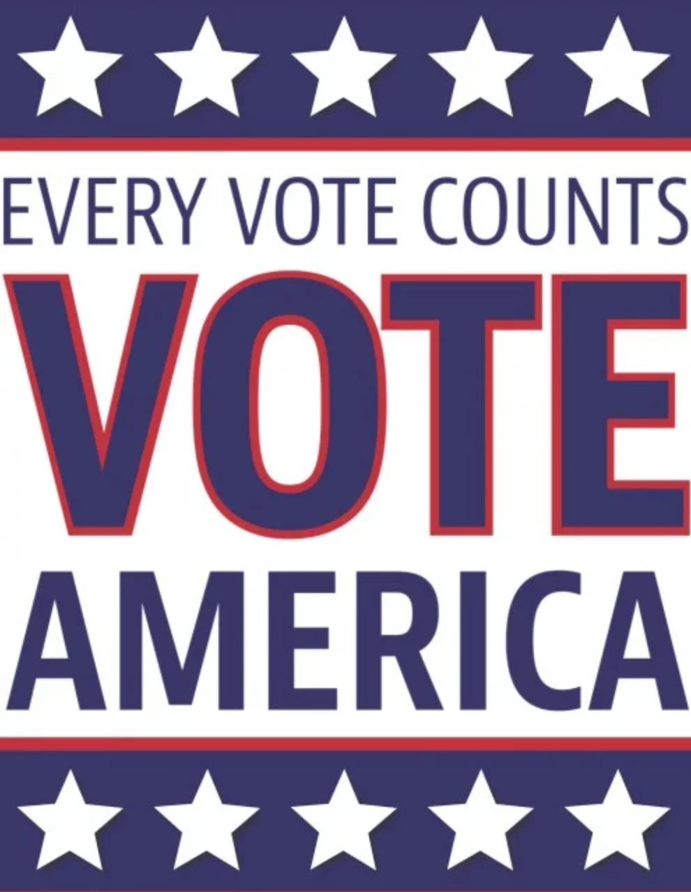
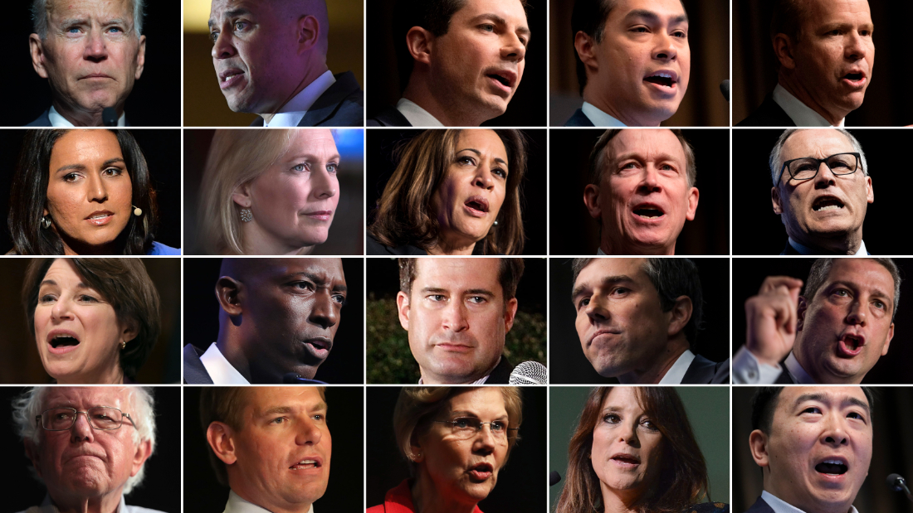
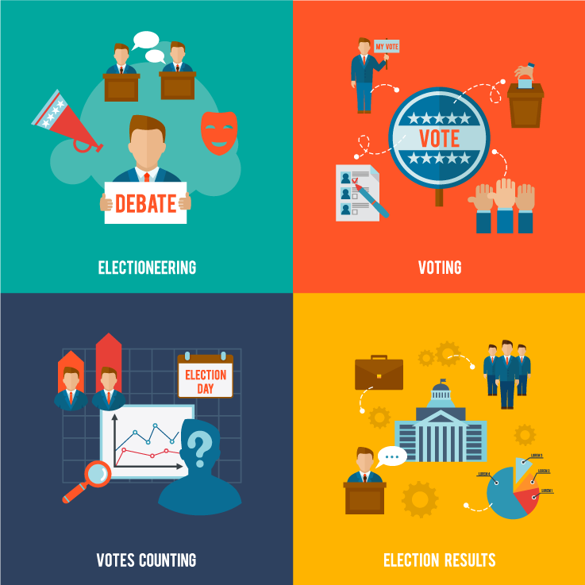

--- 
title: "Understanding 2020 Presidential Polls from Social Media Perspective"
author: "Kevin Gao '@kevinleogao' ([wg2311](mailto:wg2311@columbia.edu)), Haibo Yu '@haiboyu4' ([hy2628](mailto:hy2628@columbia.edu))"
date:  "`r format(Sys.Date(), '%B, %Y')`"
site: bookdown::bookdown_site
---

# Introduction

Welcome to our project!

## Background

The election of the president and the vice president of the United States is an indirect election in which citizens of the United States who are registered to vote in one of the fifty U.S. states or in Washington, D.C.

Every once a while, the election will impact the U.S. in many aspects, such as job experience, income taxes, government investments and  since U.S. plays a key role in golabal econemy, it cerntianly drive attention from every tax payer.

Every adult citizen can vote and every vote counts, the question is: who will be the chosen one by the collective decision in this world of divergent?

And, does every individual know enough about the candidates that he/she has to choose from?

## Trends

A key part of the United States presidential campaigns is the use of media and framing. Candidates are able to frame their opponents and current issues in ways to affect the way voters will see events and the other presidential candidates.

Advances in technology and media have also affected presidential campaigns. Since the development of the internet in the mid-90s, Internet activism has also become an invaluable component of presidential campaigns, especially since 2000. 

In 2008, the internet became a grassroots and a voice of the people tool. Internet channels such as YouTube were used by candidates to share speeches and ads for free. This also served as a forum for users to attack other candidates by uploading videos of gaffes.[1]

A study done by the Pew Internet & American Life Project in conjunction with Princeton Survey Research Associates in November 2010 shows that 54 percent of adults in the United States used the internet to get information about the 2010 midterm elections and about specific candidates. This represents 73 percent of adult internet users. The study also showed that 22 percent of adult internet users used social network sites or Twitter to get information about and discuss the elections and 26 percent of all adults used cell phones to learn about or participate in campaigns.[2]

With huge impact from often biased media, general public is often mislead by the media, and then we start to see suprises after elections.
 
The presidency of Donald Trump began at noon EST on January 20, 2017, Among the 44 persons who have served as president, only Donald Trump had never held a position in either government or the military prior to taking office.

In contrast to the 2016 presidential election, where social media was a novelty, the candidates for election in 2020 had carefully managed social media strategies.

## Project

With the concerns of all those mysterious, when we try to do some research online to understand these candidates policy and who they are, we usually enter a news media website, watch on TV programs, or go on social media like Youtbue to watch all content from candidates, their campaign and their followers, or go on facebook to chat with your friends, or share tweets about this between your network on Twitter... All those learning processes give me some idea: What if peoole has no opinion in the begining and while trying to understand the politics and searching online, they are influenced by all the content they have consumed? And if that would ever affect their decisions later in the polls? And can we find the connection using statistic model between the media behaviors and polling behavrios to test our hypothesis? 

So we start a study using social media data to analyze current democrat candidates status, and help people to understand the 2020 presidential polls.

We use social website data from youtube, twitter, facebook to address the impact of social media in the 2020 United States presidential election.

### The Team

Haibo Yu (M.s. in Data Science, DSI, Columbia University)

Kevin Gao (M.s. in Data Science, DSI, Columbia University)

### The Plan

Haibo: 
1. Data collecting: Wrote a python script to do the web scraping work for youtube, facebook, twitter. 
2. Data preprocessing: Clean up missing data, unified data and merge into csv.
3. Data analysis: Data exploration and visualization

Kevin: 
1. Data pipeline: Design, and architect the data flow and project details.
2. Data analysis: Data exploration and visualization
3. Data prediction*: Apply machine learning, NLP, GLM to make predictions of our data (According to the final project instruction for EDAV, we have to restrict ourselves to exploratory techniques,rather than modeling / prediction approaches).

### The Questions

Here are main questions that we hope we will be able to answer from this research.

###### Core questions:

a) In each state, which candidate has more popularity online, in terms of views, likes, retweets...etc ?

b) For each candidate, in which state he/she has more popularity online, in terms of views, likes, retweets...etc ?

c) In general, which candidate has more popularity online ?

###### Potentially, we would like to answer these questions:

d) Who is more concentrating on what topics ?

e) Who is more popular in near future ?

f) Is our result correlating to the final election result ?

## References

 - [1]  Pollard, Timothy D.; Chesebro, James W.; Studinski, David Paul (2009). "The Role of the Internet in Presidential Campaigns". Communications Studies. 60 (5): 574–88. doi:10.1080/10510970903260418.
 
 - [2] Endres, Warnick (2004). "Text-based Interactivity in Candidate Campaign Web Sites: A case Study from the 2002 Elections". Western Journal of Communication. 68 (3): 322–42. doi:10.1080/10570310409374804.
 Smith, Aaron. "Pew Internet & American Life Project". The Internet and Campaign 2010. Pew Research Center.

